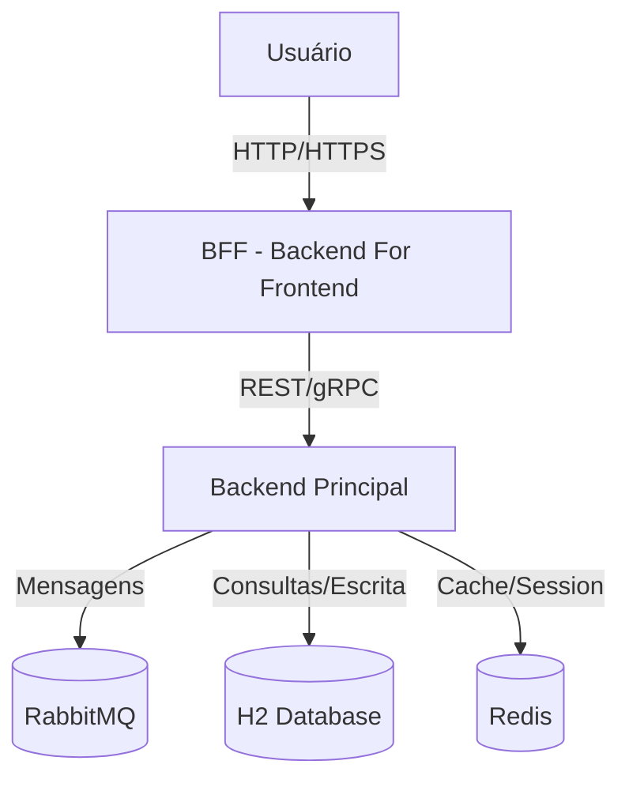

# 📘 Documentação Viva - Arquitetura do Sistema

Este documento descreve a arquitetura atual do sistema utilizando **C4 Model** e **ADRs (Architecture Decision Records)**.  
O objetivo é manter a documentação atualizada e de fácil entendimento para todos os envolvidos.

---

## 1. Contexto (C4 - Level 1: System Context)


## 2. Containers (C4 - Level 2: Container Diagram)

graph TD
    subgraph User Device
        Browser[Front-end App]
    end

    subgraph Cloud
        BFFService[BFF Service\n(Spring Boot/Node.js)]
        BackendService[Backend Service\n(Spring Boot)]
        MQ[RabbitMQ]
        DB[H2 Database]
        Cache[Redis]
    end

    Browser -->|REST/GraphQL| BFFService
    BFFService -->|REST/gRPC| BackendService
    BackendService --> MQ
    BackendService --> DB
    BackendService --> Cache

## C3 - Container Diagram

```mermaid
graph TD
    User[User] -->|HTTP REST| PaymentsController

    subgraph PaymentService [Payment Service - Spring Boot]
        Controller[PaymentsController]
        Service[PaymentService & AntifraudService]
        Repo[PaymentRepository]
        RedisAdapter[FlagRedisAdapter]
        HttpClient[AntifraudValidationClient]
        EventPublisher[EmailEventPublisher]
        EventSubscriber[EmailEventListener]
        Config[Configs (RabbitMQ, Redis, AsyncEvents)]
    end

    subgraph Infrastructure
        DB[(H2 Database)]
        MQ[(RabbitMQ)]
        Cache[(Redis)]
        AntifraudAPI[(Antifraud Validation API - external)]
    end

    Controller --> Service
    Service --> Repo
    Service --> RedisAdapter
    Service --> HttpClient
    Repo --> DB
    RedisAdapter --> Cache
    Service --> EventPublisher
    EventPublisher --> MQ
    EventSubscriber --> Service
    HttpClient --> AntifraudAPI
```

## 🧱 ADR 0001: Use Hexagonal Architecture

**Context:** We want to design the system to be independent of specific frameworks, databases, and messaging tools. The core business logic should be separate from infrastructure concerns.

**Decision:** We'll use a **Hexagonal (Ports and Adapters) architecture** for the Payment Service.

**Consequences:**
* **✅ Pros:**
    * The domain logic remains independent of frameworks.
    * It's easier to replace external tools (like the database or message queue).
    * Improves testability by making it simpler to mock external dependencies via ports.
* **❌ Cons:**
    * Requires more boilerplate code compared to a traditional layered architecture.

## 🧑‍💻 ADR 0002: Use H2 Database for Local Development

**Context:** Developers need a lightweight, embedded database for local development and testing without the overhead of setting up and managing a full-fledged database like PostgreSQL or MySQL.

**Decision:** We'll use an **H2 in-memory database** for all local development and integration tests.

**Consequences:**
* **✅ Pros:**
    * Easy setup with no installation required.
    * Fast execution of integration tests.
    * The schema is automatically reset with each restart, providing a clean slate.
* **❌ Cons:**
    * Not identical to the production database, which can lead to minor differences in SQL dialect and behavior.

---

## 📄 ADR 0003: Use RabbitMQ for Asynchronous Communication

**Context:** The system needs a reliable way for the **Payment Service** to communicate asynchronously with the **Notification Service** (a mock). We considered Kafka, but it's overkill for our initial scale.

**Decision:** We'll use **RabbitMQ** as the message broker for this asynchronous communication.

**Consequences:**
* **✅ Pros:**
    * Easy integration with **Spring AMQP**.
    * Simple setup for development environments using **Docker**.
* **❌ Cons:**
    * Less suited for very high throughput compared to Kafka.

---

## 💾 ADR 0004: Use Redis for Caching

ts, the system needs to access rules for fees, interest, and country-specific information. Since these rules don't change frequently, accessing them directly from memory can avoid unnecessary REST calls to other microservices, improving overall performance.
**Decision:** We'll use **Redis** as the primary caching layer.

**Consequences:**
* **✅ Pros:**
    * Provides very fast key-value storage.
    * Well supported by **Spring Data Redis**.
    * Can be leveraged for distributed locks and pub/sub in the future.
* **❌ Cons:**
    * Requires additional infrastructure to manage and maintain.

---


## 🌐 ADR 0005: Use BFF (Backend-for-Frontend) Pattern

**Context:** The frontend application needs a tailored API that exposes only the data it needs, without exposing the complexity of the backend domain. Directly exposing microservices would tightly couple the UI to backend logic.

**Decision:** We'll introduce a **BFF (Backend-for-Frontend) layer** that acts as an API gateway specifically for the frontend.

**Consequences:**
* **✅ Pros:**
    * Enables tailored view models for the client.
    * Makes it easier to evolve the frontend without impacting the backend services.
    * Can provide fallback and security features before requests reach the core backend services.
* **❌ Cons:**
    * Adds an additional service that needs to be maintained.

---