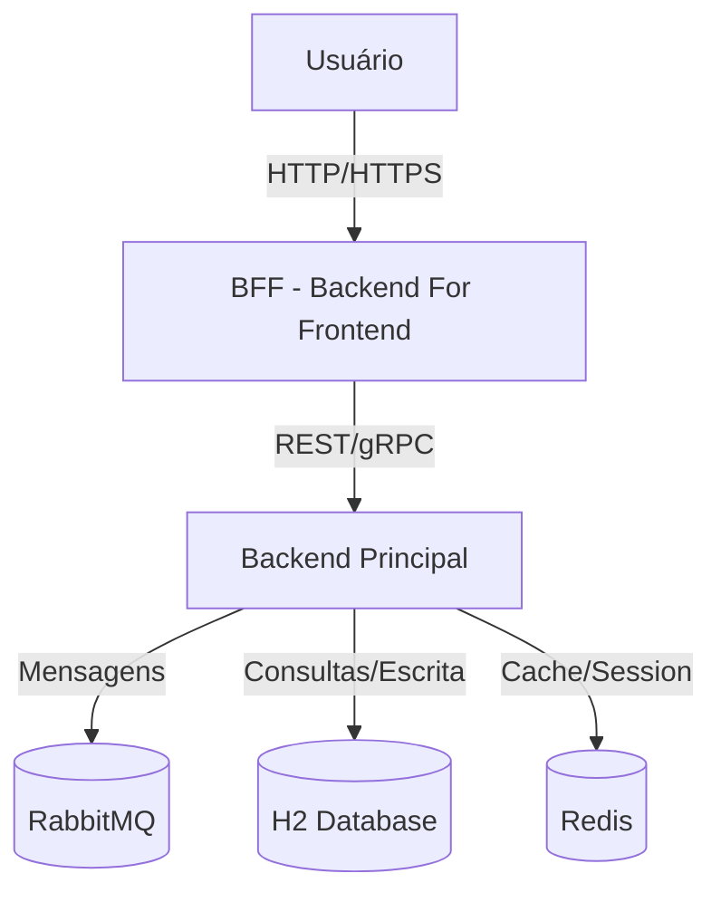
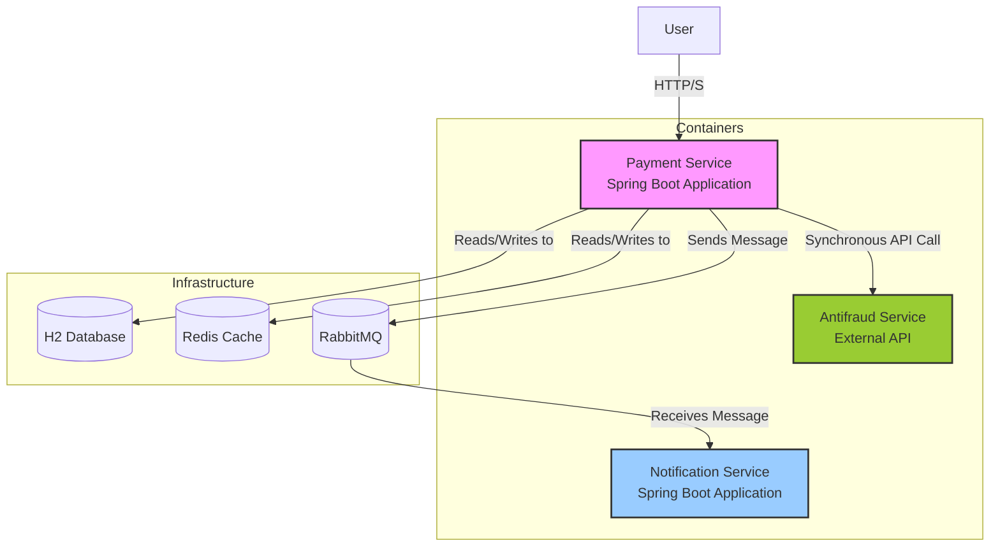

# Projeto techBRA

Este repositório contém o projeto de um serviço de pagamento, que pode ser executado localmente utilizando Docker Compose. Além disso, disponibilizamos uma collection para testes via Postman.

## Pré-requisitos

- Docker
- Docker Compose
- Postman (opcional, para testar a API com a collection)

## Como rodar o projeto

**Executar o Docker Compose**

```bash
docker-compose up -d
# 📘 Documentação Viva - Arquitetura do Sistema

```
**Executar localmente**

Para rodar o serviço , basta abrir o projeto no **IntelliJ IDEA**, localizar a classe principal:

src/main/java/br/com/felixgilioli/paymentService/PaymentServiceApplication.java

E executar o método `main`.  
Isso iniciará a aplicação com o servidor embutido do Spring Boot, disponível em:

**Vá até http://localhost:8080/swagger-ui/index.html# para analisar o Swagger**

# Fluxo de Pagamento - /post payment

O endpoint `/post payment` é o endpoint principal e foi desenvolvido para simular um fluxo completo de pagamento, incluindo validações, cálculo de taxas e impostos, e notificação assíncrona do cliente. A ideia é representar de forma simplificada as principais etapas de um processo real de pagamento, como:

- Verificação de autenticidade da compra;
- Análise de risco de fraude;
- Aplicação de regras de negócio para taxas, impostos e parcelamento.

## Detalhamento do fluxo

1. **Consulta inicial no banco de dados**  
   Ao receber uma requisição, o sistema verifica se o pagamento já existe.

2. **Validação da transação**  
   Caso o pagamento não exista, é realizada uma validação da transação para garantir que ela está apta a continuar.
  - Como parte do mock, se o valor enviado for `422`, o sistema retorna um erro de validação.

3. **Cálculo de taxas e impostos**  
   Se a transação estiver válida, o sistema obtém as informações de taxa e imposto:
  - Esses dados são armazenados no **Redis**, permitindo um acesso rápido e evitando consultas repetidas a outros serviços.
  - A única situação em que o sistema buscará novamente essas informações é quando elas ainda não estiverem no cache ou quando o tempo de expiração de 10 minutos tiver sido atingido.

4. **Finalização do pagamento**  
   Após aplicar as taxas e impostos, o fluxo de pagamento é finalizado.

5. **Notificação assíncrona**  
   Um evento é disparado para um serviço de notificação (mockado), responsável por enviar um e-mail ao cliente confirmando o pagamento de forma assíncrona.

## Observações

- O uso do Redis garante eficiência na leitura de informações que não mudam com frequência.
- O mock de validação e notificação permite testar o fluxo sem depender de serviços externos.
- O fluxo está estruturado de forma a permitir fácil extensão, como integração com serviços reais de antifraude ou gateways de pagamento.


---
Este documento descreve a arquitetura atual do sistema utilizando **C4 Model** e **ADRs (Architecture Decision Records)**.  
O objetivo é manter a documentação atualizada e de fácil entendimento para todos os envolvidos.

---

## 1. Contexto (C4 - Level 1: System Context)


## 2. Containers (C4 - Level 2: Container Diagram)

graph TD
    subgraph User Device
        Browser[Front-end App]
    end

    subgraph Cloud
        BFFService[BFF Service\n(Spring Boot/Node.js)]
        BackendService[Backend Service\n(Spring Boot)]
        MQ[RabbitMQ]
        DB[H2 Database]
        Cache[Redis]
    end

    Browser -->|REST/GraphQL| BFFService
    BFFService -->|REST/gRPC| BackendService
    BackendService --> MQ
    BackendService --> DB
    BackendService --> Cache

## C3 - Container Diagram



## 🧱 ADR 0001: Use Hexagonal Architecture

**Context:** We want to design the system to be independent of specific frameworks, databases, and messaging tools. The core business logic should be separate from infrastructure concerns.

**Decision:** We'll use a **Hexagonal (Ports and Adapters) architecture** for the Payment Service.

**Consequences:**
* **✅ Pros:**
    * The domain logic remains independent of frameworks.
    * It's easier to replace external tools (like the database or message queue).
    * Improves testability by making it simpler to mock external dependencies via ports.
* **❌ Cons:**
    * Requires more boilerplate code compared to a traditional layered architecture.

## 🧑‍💻 ADR 0002: Use H2 Database for Local Development

**Context:** Developers need a lightweight, embedded database for local development and testing without the overhead of setting up and managing a full-fledged database like PostgreSQL or MySQL.

**Decision:** We'll use an **H2 in-memory database** for all local development and integration tests.

**Consequences:**
* **✅ Pros:**
    * Easy setup with no installation required.
    * Fast execution of integration tests.
    * The schema is automatically reset with each restart, providing a clean slate.
* **❌ Cons:**
    * Not identical to the production database, which can lead to minor differences in SQL dialect and behavior.

---

## 📄 ADR 0003: Use RabbitMQ for Asynchronous Communication

**Context:** The system needs a reliable way for the **Payment Service** to communicate asynchronously with the **Notification Service** (a mock). We considered Kafka, but it's overkill for our initial scale.

**Decision:** We'll use **RabbitMQ** as the message broker for this asynchronous communication.

**Consequences:**
* **✅ Pros:**
    * Easy integration with **Spring AMQP**.
    * Simple setup for development environments using **Docker**.
* **❌ Cons:**
    * Less suited for very high throughput compared to Kafka.

---

## 💾 ADR 0004: Use Redis for Caching

ts, the system needs to access rules for fees, interest, and country-specific information. Since these rules don't change frequently, accessing them directly from memory can avoid unnecessary REST calls to other microservices, improving overall performance.
**Decision:** We'll use **Redis** as the primary caching layer.

**Consequences:**
* **✅ Pros:**
    * Provides very fast key-value storage.
    * Well supported by **Spring Data Redis**.
    * Can be leveraged for distributed locks and pub/sub in the future.
* **❌ Cons:**
    * Requires additional infrastructure to manage and maintain.

---


## 🌐 ADR 0005: Use BFF (Backend-for-Frontend) Pattern

**Context:** The frontend application needs a tailored API that exposes only the data it needs, without exposing the complexity of the backend domain. Directly exposing microservices would tightly couple the UI to backend logic.

**Decision:** We'll introduce a **BFF (Backend-for-Frontend) layer** that acts as an API gateway specifically for the frontend.

**Consequences:**
* **✅ Pros:**
    * Enables tailored view models for the client.
    * Makes it easier to evolve the frontend without impacting the backend services.
    * Can provide fallback and security features before requests reach the core backend services.
* **❌ Cons:**
    * Adds an additional service that needs to be maintained.

---